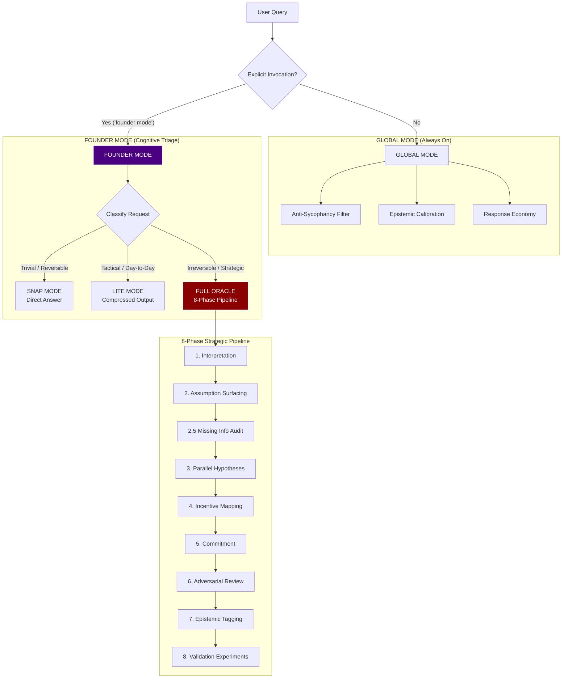

<pre>
   ___  ____    _    ____ _     _____ 
  / _ \|  _ \  / \  / ___| |   | ____|
 | | | | |_) |/ _ \| |   | |   |  _|  
 | |_| |  _ &lt;/ ___ \ |___| |___| |___ 
  \___/|_| \_\_/   \_\____|_____|_____|
</pre>
  <h1>🧠 Oracle Cognitive OS Prompt</h1>
  
<strong>Transforming LLMs from "Pleasant Assistants" into "Useful Thinkers"</strong>

  

    <h1>CONVERT YOUR AI INTO A CO-FOUNDER OR STARTUP MENTOR.</h1>
    <h2>MAKE GEMINI PRO SMARTER.</h2>
    <h2>CONVERT GEMINI PRO TO CLAUDE OPUS LEVEL.</h2>
  

  

    An enterprise-grade system prompt architecture designed to override default LLM sycophancy, enforce epistemic honesty, and execute frontier-level strategic reasoning through cognitive triage and adversarial hypothesis generation.
  

---

## 🛑 The "Sycophancy Trap" in Commercial LLMs

By default, commercial LLMs (Gemini, Claude, GPT) are aggressively tuned for RLHF (Reinforcement Learning from Human Feedback) targets that optimize for:
1. **Politeness over Precision**
2. **Emotional Smoothing over Hard Truths**
3. **Platitudes over Tradeoff Analysis**

**The result:** The model hedges, over-validates bad ideas, and fails to simulate realistic market psychology. 

While **prompting cannot magically increase a model's latent parameter count**, it **can** fundamentally change its optimization target. By stripping away the "cheerful assistant" persona, we expose the underlying cognitive horsepower.

---

## ⚙️ Cognitive Architecture Overview

The Oracle Prompt acts as a **Master Switch**, dynamically routing requests through different cognitive frameworks based on the severity and reversibility of the prompt.

---

## 🔬 Core Cognitive Modules Explained

This prompt does not rely on simple instructions like "think step by step." It forces structural compliance across several advanced cognitive engines:

### 1. Missing Information Audit (Anti-Confabulation)
Before generating an answer, the model must execute **Phase 2.5**. It explicitly identifies:
* What critical information is missing.
* What is being implicitly assumed.
* What is genuinely unknowable.
* *Rule: If critical information is missing and obtainable <14 days, the model refuses strategic recommendation and suggests obtaining the data first.*

### 2. Parallel Hypothesis Generation & Adversarial Comparison
To prevent premature convergence (the "first coherent answer wins" problem), **Phase 3** forces the model to generate **THREE substantively different framings**, hold them in tension, and run an adversarial comparison:
* Which frame would the others call naive?
* Which frame survives the strongest attacks?

### 3. Edge-Case Pressure Testing
During **Phase 6 (Adversarial Review)**, the model attacks its own recommendation by searching for:
* **Scaling Cliffs:** When does the strategy break?
* **Incentive Inversions:** When does a happy user become a churned one?
* **Operational Edges:** What happens under peak load or adversarial use?

### 4. Nuanced Market Psychology
The model is forbidden from treating market actors as rational utility maximizers. It must separate *Stated Preferences* (what enterprise buyers say they want) from *Actual Optimization Targets* (career risk, status, political safety).

---

## 📂 Repository Structure & Evolution

This architecture was not built in a day. It evolved through intense iteration, systematically breaking down LLM failure modes. 

* `prompts/oracle_system_prompt.md`: The final masterpiece OS prompt.
* `prompts/evolution/`: Directory containing the history of the prompt iterations, tracing the engineering from the simplest version up to the final OS.

---

## 🚀 Deployment Instructions

1. Copy the raw text from `prompts/oracle_system_prompt.md`.
2. Paste it into your LLM's System Prompt / Custom Instructions field.
3. Chat normally. The system will operate in **Global Mode** (sharp, concise, epistemically honest).
4. When you need deep strategic reasoning, trigger the 8-Phase pipeline by prepending your message with: `founder mode` or `strategic question:`.
